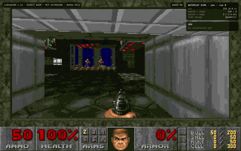
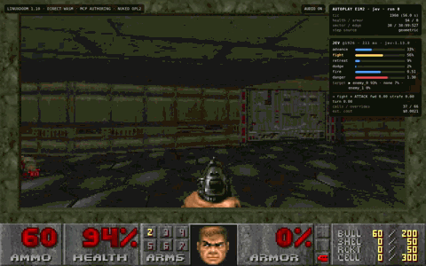

# Web DOOM — Direct LinuxDOOM + AI Authoring MCP P2.2

[English](README.md) · **한국어**

**id Software LinuxDOOM 1.10** 을 WebAssembly 로 직접 포팅하고, 그 위에 결정론적 검증, 자율 QA, 보수적 자가 복구, 원본 없는 레벨 생성, 게임 디자인 평가, 데스매치 생성, 설정 가능한 로컬 AI 플레이어 봇을 얹은 AI 네이티브 DOOM 저작 샌드박스입니다.

`/direct/` 런타임은 원본 LinuxDOOM 의 게임플레이, 렌더링, WAD 코드를 그대로 쓰고 브라우저 플랫폼 어댑터만 이 저장소가 소유합니다. Chocolate Doom 은 바닐라/DMX 호환 OPL 음악 서브시스템 하나만 고정 버전으로 가져다 쓰며, 게임 런타임으로는 쓰지 않습니다.

## 프로젝트 현황

**`main` 에 P0 부터 P2.2 까지 전체 스택이 들어 있습니다.**

- 공개 direct 빌드: https://pavy23.github.io/web-doom/direct/
- 이전 doomgeneric 비교 빌드: https://pavy23.github.io/web-doom/
- 현재 소스 브랜치: `main`
- 현재 MCP 버전: **2.8.0-p2.2**
- 오토플레이 (로컬): 결정론적 경로 추종기 + TypeSafe Jev 전술 정책. E1M1 과 E1M2 는 Hurt Me Plenty 에서 10/10 클리어, E1M3 는 진행 중. [오토플레이](#오토플레이--자동-스테이지-클리어) 참고
- 다음 마일스톤: **P3.0 온라인 브라우저 멀티플레이 전송**

> 공개된 `/direct/` 배포본은 검증을 마친 P2.2 봇 지원 빌드입니다. 런처에서 **PLAY CLASSIC DOOM** 과 **PLAY AI DEATHMATCH** 를 고를 수 있습니다. AI Deathmatch 는 함께 배포되는 생성 맵 `p22-demo.wad` 를 불러오고, 플레이어 1 을 사람으로 두어 Easy / Normal / Hard 로컬 AI 플레이어와 붙입니다.

### 공개 런처

- **PLAY CLASSIC DOOM** — 로컬 플레이어 한 명으로 즐기는 원본 셰어웨어 캠페인.
- **PLAY AI DEATHMATCH** — 결정론적 P2.2 데모 아레나. 플레이어 1 은 사람, 나머지 세 자리는 실제 LinuxDOOM AI 플레이어 슬롯 (Easy / Normal / Hard).

함께 배포되는 공개 아레나는 `/direct/` 발행 전에 CI 에서 생성되고 검증됩니다.

```text
p22-demo.wad
E1M1
fairness 84.67 / B
8 deathmatch starts
8 loops
nearest-weapon cost CV 0.001
high-value-item cost CV 0.000
```

## 완료된 마일스톤

| 마일스톤 | 상태 | 확보한 능력 |
|---|---|---|
| P0 | ✅ | 신뢰할 수 있는 원자적 에피소드 저작 |
| P1.1 | ✅ | 일반 THINGS 저작 |
| P1.2 | ✅ | 시맨틱 지오메트리 저작 |
| P1.3 | ✅ | 내비게이션 그래프 + 자율 QA |
| P1.4 | ✅ | 진단 → 복구 → 재빌드 → 재생 폐루프 |
| P2.0 | ✅ | 원본 없는 빈 맵 생성 |
| P2.1 | ✅ | 결정론적 게임 디자인 평가기 |
| P2.2 | ✅ | 데스매치 생성 + 공정성 평가 + 로컬 AI 플레이어 |
| P3.0 | ⏭️ | 온라인 브라우저 멀티플레이 전송 |

전체 파이프라인은 **기존 레벨이 전혀 없는 상태에서도** 시작할 수 있습니다.

```text
상위 수준 저작 요청
        ↓
원본 없는 맵 / 데스매치 생성
        ↓
P0 원자적 트랜잭션
        ↓
P1.1 THINGS + P1.2 시맨틱 지오메트리
        ↓
결정론적 토폴로지 / 배치 검증
        ↓
고정 버전 ZDBSP 재빌드
        ↓
P1.3 내비게이션 / 진행 분석
        ↓
P2.1 싱글플레이 디자인 프록시 평가
또는
P2.2 데스매치 공정성 평가
        ↓
실제 LinuxDOOM / Chromium 런타임
        ↓
자율 플레이테스트 / 로컬 AI 플레이어 매치
        ↓
P1.4 복구 또는 새 저작 반복
        ↓
재빌드 + 전후 비교
```

AI 가 BSP 노드를 직접 쓰지는 않습니다. 구조 편집은 결정론적 검증과 고정 버전 노드 빌더 파이프라인을 통과해야만 LinuxDOOM 이 읽습니다.

## P2.2 — 원본 없는 데스매치 생성

채택된 기본 데스매치 시드는 **팔각 링 + 경합하는 중앙** 토폴로지입니다.

- 링 섹터 8 개 + 중앙 섹터 1 개
- DoomEd 11 데스매치 시작점 8 개
- 실제 플레이어 1 부터 4 까지의 시작점
- 서로 독립적인 내비게이션 순환로 여러 개
- 모든 스폰에서 동일한 반경의 샷건과 셸 접근성
- 중앙의 로켓 런처를 고가치 경합 아이템으로 배치
- 중앙 진입로 주변의 체력과 방어구
- 셰어웨어에서 안전한 `STARTAN3 / FLOOR4_8 / CEIL3_5` 재질

설계 원칙은 이렇습니다.

> **기본 생존 자원은 대칭으로, 고가치 통제권은 경쟁으로 남긴다.**

### 결정론적 공정성 평가

P2.2 는 멀티플레이 맵을 다음 항목의 재현 가능한 프록시로 채점합니다.

- 스폰 간 쌍별 거리
- 스폰에서 무기까지의 접근성
- 초반 경로 선택지
- 초기 시야 노출도
- 고가치 아이템 접근 형평성
- 토폴로지와 순환로 품질

채택된 균형 시드는 **84.67 / B** 를 받습니다. 의도적으로 편향시킨 비교 후보는 **48.2 / F** 까지 떨어집니다. 덕분에 주관적 평가에만 기대지 않고 AI 주도의 전후 밸런싱이 가능합니다.

## 진짜 로컬 AI 플레이어

P2.2 봇은 원본 LinuxDOOM 의 **`players[0..3]` 플레이어 슬롯**을 씁니다. 플레이어로 위장한 몬스터가 아닙니다.

```text
LinuxDOOM G_Ticker
       │
       ├─ Player 1 ticcmd
       ├─ Player 2 ticcmd
       ├─ Player 3 ticcmd
       └─ Player 4 ticcmd
             ▲
             │
     doom_multi_agent.c
             ▲
             │
 deterministic bot policy
```

P2.2 는 의도적으로 브라우저 프로세스 하나, 네트워크 노드 하나를 유지합니다.

```text
netgame = false
numnodes = 1
numplayers = 1..4
```

이렇게 해야 로컬 멀티플레이와 게임플레이 의미론이 원격 네트워크 동기화와 분리됩니다. 원격 동기화는 P3.0 의 몫입니다.

### 지원하는 로컬 모드

- **사람 1 명 + AI 봇 3 명**
- 재현 가능한 자동 밸런스 시험을 위한 **AI 봇 4 명**
- 봇별 난이도 선택
- 브라우저 콘솔에서 봇 난이도 실시간 변경

### 봇 난이도 프리셋

| 난이도 | 반응 틱 | 조준 허용 오차 | 특징 |
|---|---:|---:|---|
| Easy | 10 | 20° | 느린 반응, 낮은 공격성과 회피 |
| Normal | 5 | 11° | 균형 잡힌 기준값 |
| Hard | 3 | 6° | 빠르고 공격적이며 회피가 강함 |
| Nightmare | 1 | 2.5° | 거의 매 틱 판단, 조준이 촘촘함 |

난이도는 이동, 선회 이득, 횡이동, 공격성, 아이템 선호, 회피 행동까지 함께 바꿉니다.

### 사람 1 명 + 봇 3 명

인터랙티브 모드에서 플레이어 1 은 평소의 브라우저 입력 경로를 그대로 쓰고, 플레이어 2 부터 4 는 각각 독립된 AI ticcmd 스트림을 받습니다.

```text
Player 1  human keyboard / mouse
Player 2  configurable bot
Player 3  configurable bot
Player 4  configurable bot
```

CI 는 플레이어 2 부터 4 가 실제 봇 판단을 받는 동안 플레이어 1 의 봇 오버라이드가 비활성으로 남아 있는지 검증합니다. 별도의 4 봇 런타임 수용 시험은 원본 LinuxDOOM 규칙 아래에서 실제 이동, 전투, 피해, 데스매치 리스폰, 프래그가 일어나는지도 확인합니다.

실시간 제어:

```js
DoomLocalBots.status()
DoomLocalBots.setSkill(1, 'hard')      // Player 2
DoomLocalBots.setSkill(2, 'nightmare') // Player 3
DoomLocalBots.stop()
DoomLocalBots.start()
```

## MCP 진입점

통합 진입점은 다음 파일입니다.

```text
mcp/p2_human_bot_server.js
```

`mcp/` 에서 실행합니다.

```bash
npm start
```

이전 마일스톤도 개별적으로 띄울 수 있습니다.

```text
npm run start:p2.2-core
npm run start:p2.1
npm run start:p2.0
npm run start:p1.4
npm run start:p1.3
npm run start:p1.2
npm run start:p0
```

주요 P2.2 도구는 다음과 같습니다.

- `doom_p2_deathmatch_status`
- `doom_get_deathmatch_policy`
- `doom_get_bot_skill_profiles`
- `doom_resolve_bot_skill`
- `doom_create_deathmatch_arena`
- `doom_get_deathmatch_session`
- `doom_begin_deathmatch_transaction`
- `doom_apply_deathmatch_edits`
- `doom_validate_deathmatch_transaction`
- `doom_commit_deathmatch_transaction`
- `doom_rollback_deathmatch_transaction`
- `doom_build_deathmatch_level`
- `doom_evaluate_deathmatch_fairness`
- `doom_compare_deathmatch_fairness`
- `doom_run_local_bot_deathmatch`
- `doom_prepare_human_bot_arena`

P0 부터 P2.1 까지의 모든 도구는 P2.2 서버 아래에 그대로 합성되어 있습니다.

## Windows + WSL 빠른 시작

P2.2 봇 지원 런타임은 제공되는 PowerShell 래퍼로 빌드합니다. 고정 버전 LinuxDOOM/Emscripten 빌드 파이프라인이 리눅스 기반이라 WSL 을 씁니다.

```powershell
cd D:\web-doom

git switch main
git pull

.\direct-port\prepare_p22_runtime.ps1

cd mcp
npm install
npm start
```

래퍼는 봇 지원 런타임을 다음 위치에 씁니다.

```text
mcp/.cache/p22-runtime
```

그리고 현재 PowerShell 세션에 `DOOM_MCP_GAME_DIR` 를 설정합니다.

### Grok MCP 등록 예시

```powershell
grok mcp add --scope project doom-p22 -- node D:\web-doom\mcp\p2_human_bot_server.js
```

일반적인 인터랙티브 흐름은 이렇습니다.

1. `doom_create_deathmatch_arena` 를 호출해 WAD 를 내보냅니다.
2. 공정성 도구로 살펴보거나 반복 개선합니다.
3. 봇 난이도 셋을 넣어 `doom_prepare_human_bot_arena` 를 호출합니다. 예를 들어 `easy`, `hard`, `nightmare` 입니다.
4. 반환된 localhost URL 을 엽니다.
5. **CLICK TO START** 를 누릅니다.
6. 플레이어 1 로 평소처럼 플레이하며 AI 플레이어 세 명과 겨룹니다.

자동 밸런싱에는 `doom_run_local_bot_deathmatch` 를 `all_bots` 모드로 씁니다.

## 오토플레이 — 자동 스테이지 클리어

`mcp/autoplay_stage_runner.mjs` 는 사람 입력 없이 싱글플레이 캠페인을 플레이합니다. **로컬에서만** 동작하며, Node 가 정확 틱 제어 브릿지를 통해 Playwright Chromium 을 조종합니다. 공개된 `/direct/` 페이지에는 포함되지 않습니다.

두 개의 층으로 되어 있습니다.

1. **결정론적 경로 추종기 (AI 없음).** P1.3 내비게이션 그래프 위에서 경로를 계획합니다. 문, 열쇠, 태그된 스위치, 리프트, 계단 빌더를 비롯한 바닥 이동 장치를 다룹니다. 볼록하지 않은 섹터 안에서 벽, 구덩이, 니코지를 우회하는 지역 경로 탐색, 정확 틱 추종, 출구 스위치 작동, `GS_LEVEL` 이탈 검증까지 포함합니다. 한 번의 런은 명령 수열의 순수 함수라, 같은 런은 틱 단위로 그대로 재현됩니다.
2. **전술 정책 (TypeSafe System One, Jev).** 적이 사정권에 있는 스텝마다 엔진 상태를 약 1,400 토큰으로 압축해 Jev 에게 타입이 정해진 질문 다섯 개를 묻습니다. 계속 달려도 안전한지, 어떻게 대응할지, 어느 적을 노릴지, 쏠지, 위험도가 얼마인지입니다. 그 위에 코드가 소유한 안전 규칙이 얹힙니다. 교착, 근접 사격, 히트스캔 교전, 저체력 정지, 투사체 회피 횡이동, 기하학적 엄폐, 무기 선택, 지형 가드, 아이템 획득입니다. 목적함수는 사전식 순서로 사망 수, 받은 피해, 월드 틱 순입니다.

목적함수는 모든 맵에서 같지만, 그것을 달성하는 임계값은 맵마다 WAD 와 내비게이션 그래프에서 유도합니다. 경로상 몬스터 수와 공격 방식, 주울 수 있는 아이템, 경로 길이가 입력입니다. 그래서 히트스캔 몬스터 40 마리짜리 레벨과 6 마리짜리 레벨이 "체력 50 아래면 메디킷을 주우러 간다" 는 규칙을 공유하지 않습니다. 맵 이름에 의존하는 부분이 없으므로 생성된 맵도 프로필을 갖습니다.

`--record` 로 촬영한 클립 두 개가 있습니다. 월드 틱 하나당 프레임 하나라 게임 시간 그대로 재생됩니다. 아래 미리보기는 8 초 발췌이고, 전체 클립은 프로젝트 페이지에서 재생됩니다. **[Web DOOM autoplay clips](https://pavy23.github.io/web-doom/docs/autoplay/)** 입니다. E1M1 은 36 초에 사망 0, 피해 26 이고, E1M2 는 2 분에 사망 0, 피해 69 입니다. 같은 맵에서 추종기 단독으로는 183 을 받습니다. 오른쪽 위 패널은 각 판단 시점의 정책 결정입니다.

| E1M1, Hurt Me Plenty | E1M2, Hurt Me Plenty |
|---|---|
| [](https://pavy23.github.io/web-doom/docs/autoplay/) | [](https://pavy23.github.io/web-doom/docs/autoplay/) |

클립 내려받기:
**[E1M1, 3.4 MB](https://github.com/pavy23/web-doom/raw/main/docs/autoplay/e1m1-hmp-jev.webm)**
·
**[E1M2, 10.7 MB](https://github.com/pavy23/web-doom/raw/main/docs/autoplay/e1m2-hmp-jev.webm)**
입니다. 이 링크는 원본 파일을 그대로 내려보냅니다. 브라우저에 따라 바로 저장되거나 미디어 탭으로 열리는데, 우클릭 저장은 언제나 됩니다. 위 프로젝트 페이지에는 같은 두 개가 진짜 다운로드 버튼으로 걸려 있고 그쪽이 더 확실합니다. GitHub 의 파일 보기는 WebM 을 아예 재생하지 못합니다.

클립은 WebM 컨테이너에 담긴 VP8 입니다. 요즘 브라우저는 전부 재생하지만 발표 자료나 영상 편집 도구는 대개 못 엽니다. 전체 기능이 들어간 ffmpeg 빌드라면 H.264 MP4 로 바꿀 수 있습니다.

```bash
ffmpeg -i e1m1-hmp-jev.webm -c:v libx264 -preset slow -crf 20 -pix_fmt yuv420p e1m1-hmp-jev.mp4
```

### 실행 방법

**준비**, 한 번만 하면 됩니다. 필요한 것은 Node 20 이상뿐입니다. 셰어웨어 IWAD 는 저장소에 들어 있으니 따로 구하실 것이 없습니다.

```bash
git clone https://github.com/pavy23/web-doom.git
cd web-doom/mcp
npm install
npx playwright install chromium    # npm install 이 보통 같이 받습니다. 브라우저가 없을 때만 실행하세요
```

**첫 실행**, 키가 필요 없습니다. 준비가 제대로 됐는지 확인하는 용도입니다.

```bash
npm run autoplay:e1m1
```

E1M1 을 무적 모드로 세 번 돌고 틱 단위 결정성까지 확인합니다. 런마다 `autoplay E1M1 run N: CLEARED` 가 찍히고, 마지막 `autoplay summary` 줄에 `"cleared":3` 이 나오면 환경이 준비된 것입니다.

**몬스터를 살려두고 실제로 보려면** 이렇게 합니다. 추종기 단독이고 AI 는 쓰지 않습니다.

```bash
npm run autoplay:e1m1:live
```

**Jev 정책을 붙이려면** 여기서부터 키가 필요합니다. 명령에 `--policy jev` 가 들어간 스크립트만 해당됩니다.

```bash
export TYPESAFE_API_KEY=...
npm run autoplay:e1m1:hmp:watch    # 창을 띄워서 판단 패널과 함께 봅니다
npm run autoplay:e1m2:hmp:x10      # 10 런 프로토콜, 창 없이, 4 런씩 병렬
npm run autoplay:compare:e1m2      # 95% 신뢰구간 클리어율, 피해, 틱, 엣지별 표
```

10 런 시험 하나에 약 0.10 달러에서 0.30 달러가 들고, 맵에 따라 7 분에서 26 분 걸립니다.

**나머지 도구들입니다.**

```bash
npm run autoplay:e1m1:hmp:baseline   # 추종기 단독 결과. 정책을 견주는 기준선
npm run autoplay:e1m1:uv:control     # 규칙만, 모델은 한 번도 부르지 않는 대조군
npm run autoplay:e1m1:hmp:record     # exports/autoplay/.../run-0.webm 으로 기록 (정책을 쓰므로 키가 필요합니다)
npm run autoplay:dashboard           # 오프라인 HTML 대시보드
node autoplay_postmortem.mjs exports/autoplay/e1m3-jev-hmp-x10   # 각 런이 어디서 피해를 받고 죽었는지
```

**결과가 쌓이는 곳입니다.** 시험마다 `mcp/exports/autoplay/` 아래에 폴더가 하나씩 생기고 `report.json`, `steps.jsonl`, `jev.jsonl` 이 들어갑니다. 이 디렉터리는 gitignore 에 걸려 있어서 무엇을 돌리든 커밋에 섞이지 않습니다.

**실행이 안 될 때 확인할 것들입니다.**

| 증상 | 해결 |
|---|---|
| Chromium 을 못 찾거나 버전이 안 맞음 | `export DOOM_MCP_CHROMIUM_EXECUTABLE=/path/to/chromium` |
| 포트 3777 이 이미 사용 중이거나 두 개를 동시에 돌릴 때 | `export DOOM_MCP_PORT=3778` |
| `--record` 가 ffmpeg 를 못 찾음 | `npx playwright install ffmpeg` 또는 `DOOM_MCP_FFMPEG` 로 경로 지정 |
| 정책 호출에서 401 | `TYPESAFE_API_KEY` 가 없거나 틀렸습니다. 위의 키 없는 스크립트들은 그대로 돕니다 |

**플래그입니다.** npm 스크립트 대신 CLI 를 직접 부를 때 씁니다. `--map E1M1..E1M3`, `--skill itytd|hntr|hmp|uv|nightmare`, `--policy jev|rules|none`, `--jev-pipeline 8` (답을 해당 상태보다 8 틱 뒤에 적용해 모델이 생각하는 동안 세계가 멈추지 않게 합니다), `--concurrency N` (한 시험의 런을 병렬로 돌립니다. 4 로 두면 10 런 시험의 실소요가 약 3 분의 1 로 줄고 출력은 스텝 단위로 동일합니다), `--jev-opt key=value` (정책 설정 하나를 덮어씁니다. 대조 실험용입니다), `--headed`, `--record`, `--runs N`, `--baseline other/report.json`.

### 결과 (표기가 없으면 10 런 시험, 정책 0.7.x, `--jev-pipeline 8`)

| 맵, 난이도 | 추종기 단독 (AI 없음) | Jev 정책 | 비고 |
|---|---|---|---|
| E1M1, ITYTD | 클리어 | 3/3 | 첫 실전 런 |
| E1M1, HMP | 출구 복도에서 사망 | **10/10**, 피해 18-39 (정책 0.8.1, 0.6.2 에서는 15 [0-24]) | |
| E1M1, UV | 안뜰에서 사망 | 1-2/10 (합산 5/16), 규칙 전용 대조군 0/10 | 능력 경계선: 권총으로 개활 격납고의 샷건 가이 16 명 상대 |
| E1M2, HMP | 클리어, 피해 183 | **10/10**, 피해 105 [69-150], 시간 +7% | 열쇠, 원격 문, 리프트 |
| E1M3, HMP | 틱 587 에 사망 | 시험 9 회에 걸쳐 0-1/10, 미해결 | 경로상 몬스터 40 마리 중 4 분의 3 이 히트스캔, 니코지 호수 사이 통로, 열쇠 우회, 출구 앞 계단 빌더 |
| E1M3, HNTR | 틱 1872 에 사망 | 1/10 | 몬스터가 절반이고 몬스터당 회복량은 두 배인데 클리어율은 같습니다. 이 레벨은 붐벼서 실패하는 것이 아닙니다 |

비용은 이렇습니다. 한 런이 Jev 를 70 회에서 500 회 호출하고 호출당 약 $0.00004 이므로 10 런 시험이 $0.10 에서 $0.20 입니다. 같은 판단을 프런티어 LLM 으로 받으면 35 배에서 350 배가 듭니다. 비교는 `mcp/AUTOPLAY.md` 에 있습니다.

러너, 정책의 질문과 규칙, 실패한 버전들, 모든 시험의 수치, E1M2 와 E1M3 에서 드러난 1 층의 빈틈과 그것을 메운 과정, 녹화, 파이프라이닝까지 전부 `mcp/AUTOPLAY.md` 에 있습니다. 벤더링된 `typesafe-ai` 에이전트 스킬은 `.claude/skills/typesafe-ai/` 에 있습니다 (MIT, typesafe-ai/skills 출처).

## 신뢰성 계층

### P0 — 원자적 저작

- 선택 맵 및 다중 맵 워크스페이스
- begin/apply/validate/commit/rollback 트랜잭션
- 중복, 교차, 겹침, T 자 접합, 다양체 검증
- 고정 버전에 해시 검증된 ZDBSP 재빌드
- 실제 Chromium 회귀 시험과 정확 틱 에피소드 실험

### P1.1 — 일반 THINGS

- 플레이어 시작점 / 데스매치 시작점
- 몬스터
- 무기 / 탄약
- 체력 / 방어구
- 열쇠 / 파워업 / 배럴
- 배치 검사를 동반한 영속적 추가, 이동, 수정, 삭제

### P1.2 — 시맨틱 지오메트리

- 다각형 방 돌출
- 계단
- 열쇠문 / 수동문
- 리프트
- 섹터 경계 검사
- 안전한 단순 섹터 분할

### P1.3 — 내비게이션 + 자율 QA

- 섹터/포탈 내비게이션 그래프
- 보행, 낙하, 문, 리프트, 차단 엣지
- 열쇠와 출구 진행 분석
- 결정론적 정확 틱 브라우저 주행

### P1.4 — 보수적 자동 복구

- 내비게이션 실패 진단
- 범위를 한정한 저작 지오메트리 복구
- 원자적 검증과 재빌드
- LinuxDOOM 재생 검증
- 롤백 또는 수동 복구 필요 처리

### P2.0 — 원본 없는 맵

- 정규 맵 마커와 고전 맵 lump 를 무에서 생성
- 런타임에서 안전한 생성 시드
- 생성된 지오메트리를 AI 저작물로 취급
- 새로 생성한 맵에 P0 부터 P1.4 까지 재사용

### P2.1 — 게임 디자인 평가기

- 도달성, 진행, 토폴로지, 전투, 자원, 완급에 대한 결정론적 프록시
- `balanced`, `combat`, `exploration` 프로필
- 구조화된 이슈 코드
- 정확히 동일한 정책으로 전후 비교

참고 수용 사례:

```text
Under-supported Cyberdemon candidate  70.3 (C), resources 12.25
Supported candidate                  83.5 (B), resources 100
Delta                                +13.2
```

## 테스트 명령

`mcp/` 에서 실행합니다.

정적 / 결정론적 테스트:

```bash
npm run test:p0
npm run test:p1
npm run test:p1:semantic
npm run test:p1:navigation
npm run test:p1:auto-repair
npm run test:p2
npm run test:p2:game-design
npm run test:p2:deathmatch
```

런타임 / Chromium 테스트:

```bash
npm run test:experiment
npm run test:p1:semantic:runtime
npm run test:p1:navigation:runtime
npm run test:p1:auto-repair:runtime
npm run test:p2:seed-runtime
npm run test:p2:runtime
npm run test:p2:bots:runtime
npm run test:p2:human-bots:runtime
```

P2.2 수용 시험은 P0 부터 P2.1 까지의 회귀 사슬을 그대로 유지하면서, 4 봇 시험과 사람 1 명 + 봇 3 명 시험을 실제 LinuxDOOM 브라우저에서 추가로 돌립니다.

공개 `/direct/` 발행에는 브라우저 관문이 하나 더 있습니다. `mcp/p22_public_direct_selftest.mjs` 가 갓 컴파일된 정적 후보에서 런처의 두 경로를 모두 검증해야 main 발행 커밋이 허용됩니다.

## 런타임 / 빌드 기준선

고정된 LinuxDOOM 기준선:

```text
a77dfb96cb91780ca334d0d4cfd86957558007e0
```

고정된 ZDBSP WASM 소스 리비전:

```text
acc45bf6b2232a75bdbb0b6295822e72e13dfeec
```

고정된 Chocolate Doom OPL 소스 리비전:

```text
410d96855b5df5410ff591a90efeafa889119224
```

지원하는 공개 셰어웨어 IWAD:

- 크기: 4,196,020 바이트
- MD5: `5f4eb849b1af12887dec04a2a12e5e62`

상용 DOOM 및 DOOM II IWAD 는 이 저장소가 배포하지 않습니다.

## P3.0 — 다음은 온라인 멀티플레이

P2.2 로 멀티플레이의 콘텐츠와 로컬 시뮬레이션 쪽은 입증됐습니다.

- 멀티플레이 맵을 무에서 생성할 수 있습니다.
- 공정성을 측정하고 비교할 수 있습니다.
- 실제 LinuxDOOM 플레이어 슬롯 네 개가 브라우저 하나에서 돕니다.
- AI 플레이어마다 다른 난이도를 줄 수 있습니다.
- 사람이 플레이어 1 로 AI 플레이어 세 명과 겨룰 수 있습니다.
- 공개 `/direct/` 빌드가 검증된 Classic / AI Deathmatch 분기를 노출합니다.

다음 마일스톤은 **원격 브라우저 동기화**입니다.

권장하는 첫 P3 목표:

```text
Browser A ─┐
           ├─ WebSocket relay
Browser B ─┘

same PWAD hash
same match seed
bounded 2-player match
zero deterministic tic drift
```

그다음은 원격 플레이어 4 명, 빈 자리를 채우는 봇, 로비와 재접속 지원, 더 풍부한 멀티플레이 텔레메트리입니다.

## 참고 문서

- `mcp/P2_BLANK_MAP.md`
- `mcp/P2_GAME_DESIGN.md`
- `mcp/P2_DEATHMATCH.md`
- `mcp/P2.2_BOTS.md`
- `mcp/P2_STATUS.md`
- `mcp/AUTOPLAY.md` — 자동 스테이지 클리어 (추종기 + Jev 정책, 시험, 녹화)
- `.github/P2_MULTIPLAYER_ROADMAP.md`

이 프로젝트를 지배하는 규칙은 그대로입니다.

> **AI 는 생성, 저작, 평가, 복구 행위를 제안한다. 그 결과를 받아들일지는 결정론적 검증과 노드 빌드, 그리고 실제 LinuxDOOM 런타임의 증거가 결정한다.**

---

이 문서는 [README.md](README.md) 의 한국어판입니다. 내용이 어긋날 경우 영어판이 기준입니다.
